---
## Front matter
lang: ru-RU
title: Лабораторная работа №1
subtitle: Архитектура операционных систем
author:
  - Люкшина В. А.
institute:
  - Российский университет дружбы народов, Москва, Россия
date: 07 марта 2025

## i18n babel
babel-lang: russian
babel-otherlangs: english

## Fonts
mainfont: IBM Plex Serif
romanfont: IBM Plex Serif
sansfont: IBM Plex Sans
monofont: IBM Plex Mono
mathfont: STIX Two Math
mainfontoptions: Ligatures=Common,Ligatures=TeX,Scale=0.94
romanfontoptions: Ligatures=Common,Ligatures=TeX,Scale=0.94
sansfontoptions: Ligatures=Common,Ligatures=TeX,Scale=MatchLowercase,Scale=0.94
monofontoptions: Scale=MatchLowercase,Scale=0.94,FakeStretch=0.9
mathfontoptions:

## Formatting pdf
toc: false
toc-title: Содержание
slide_level: 2
aspectratio: 169
section-titles: true
theme: metropolis
header-includes:
 - \metroset{progressbar=frametitle,sectionpage=progressbar,numbering=fraction}
---

# Информация

## Докладчик

:::::::::::::: {.columns align=center}
::: {.column width="70%"}

  * Люкшина Влада Алексеевна
  * факультет физико-математических наук
  * студент 1 курс НПИбд-02-24
  * Российский университет дружбы народов
  * [1132243022@pfur.ru]
  * <https://github.com/valyukshina/study_2024-2025_os-intro.git>

:::
::: {.column width="30%"}

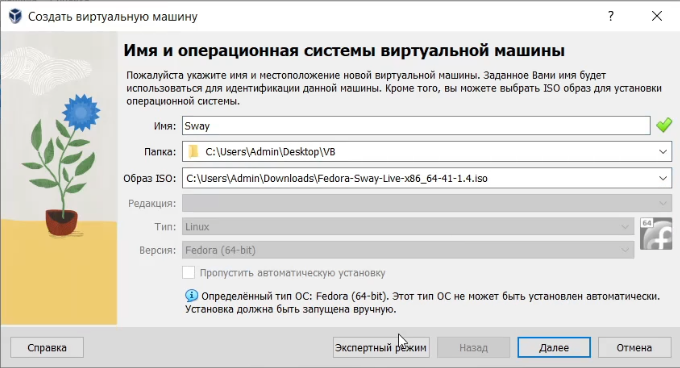

:::
::::::::::::::

# Вводная часть

## Актуальность

- Презентация является эффективным методом представления итогов и хода лабораторной работы.

## Цель

- Целью данной работы является приобретение практических навыков установки операционной системы на виртуальную машину, настройки минимально необходимых для дальнейшей работы сервисов.  

## Задачи

Установить виртуальную машину, образ виртуальной машины и настроить операционную систему.  

# Выполнение лабораторной работы №1
## Установка образа
- Первым ключевым пунктом лабораторной работы №1 является установка виртуальной машины и ее образа. Виртуальная машина была установлена в 1 семестре, поэтому сразу приступаем к установке образа. Выбираем нужный файл образа, необходимые настройки и запускаем.  

  

## Установка образа
- После загрузки следуя подсказкам доустанавливаем операционную систему, устанавливаем имя пользователя и пароль.  

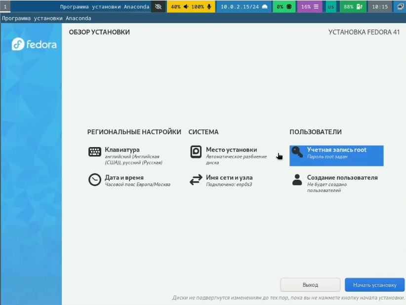  

## Настройка ОС
- Теперь непосредственно следуем плану, прописанному в лабораторной работе №1. Переключаемся на роль супер-пользователя и устанавливаем средства разработки.  

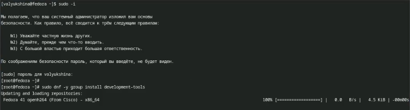  

## Настройка ОС
- Обновляем все пакеты и для удобства устанавливаем tmux.  

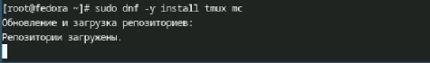  

## Настройка ОС
- Устанавливаем автоматическое обновление и запускаем таймер.  

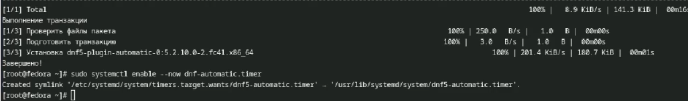  

## Отключение системы безопасности 
- Далее нам необходимо отключить систему безопасности SELinux. Редактируем файл и перезагружаем виртуальную машину.  

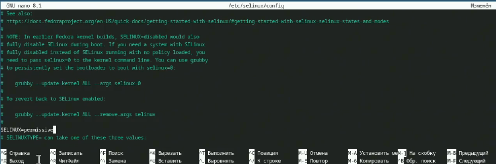  

## Настройка раскладки клавиатуры
- Настраиваем раскладку клавиатуры. Создаем конфигурационный файл и редактируем его, после чего редактируем второй конфигурационный файл. Перезагружаем виртуальную машину.  

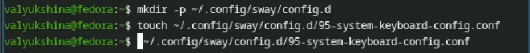  

## Настройка раскладки клавиатуры
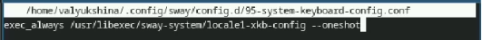  

## Настройка раскладки клавиатуры
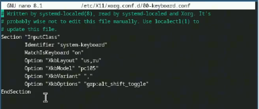  

## Установка хоста
- Следующим пунктом нам нужно поменять логин и пароль, если они не удовлетворяют требованиям. Я пропускаю этот пункт, так как изначально установила верные имя и пароль. Устанавливаем имя хоста и проверяем корректность установки.  

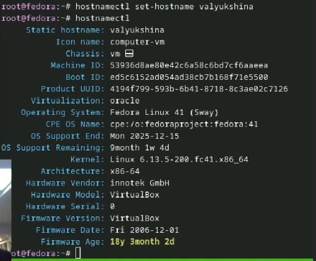  

## Установка pandoc
- Для работы с языком разметки Markdown будем использовать pandoc. Устанавливаем его через терминал.  

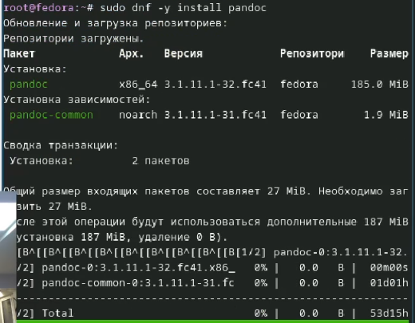  

## Установка pandoc
- В стандартном пакете нет доп пакета pandoc crossref, поэтому скачиваем его вручную. Смотрим версию утсановленного pandoc и скачиваем с сайта подходящий пакет. Распаковываем архив и перемещаем файлы в каталог.  

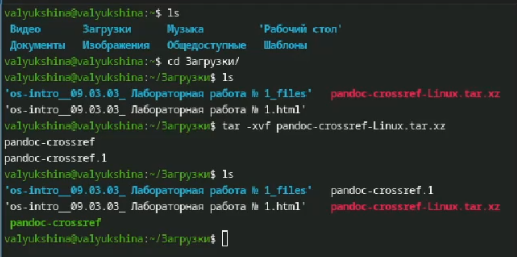  

## Установка texlive
- Устанавливаем дистрибутив texlive.  

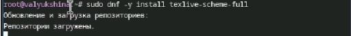  

# Домашнее задание
## Команда dmesg
- В домашнем задании нам нужно поработать с командой dmesg. С помощью вывода этой команды анализируем последовательность загрузки системы.  

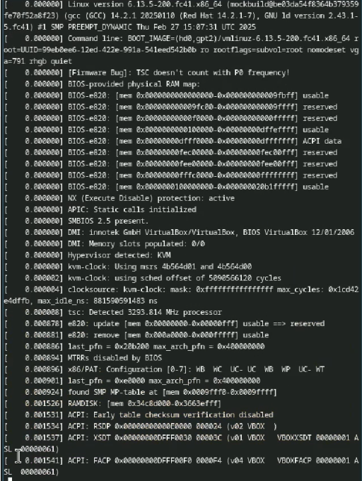  

## Команда grep
- Используя grep мы можем получить отдельную интересующую нас информацию. Используем команду и получаем требуемую информацию.  

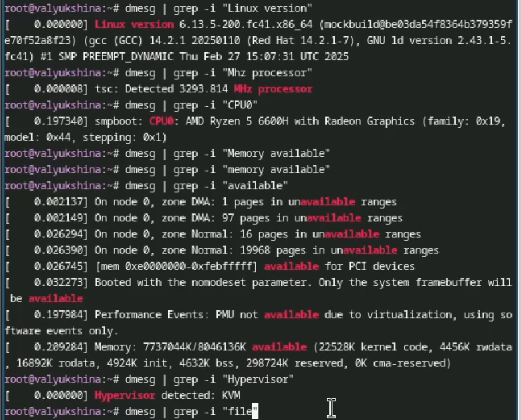  

# Выводы
## Вывод

- В ходе лабораторной работы №1 мы создали новый образ виртуальной машины с новой ОС, научились настраивать через терминал и установили утилиты для удобства.  

