---
## Front matter
title: "Лабораторная работа №1"
subtitle: "Дисциплина: Архитектура операционных систем"
author: "Люкшина Влада Алексеевна НПИбд-02-24"

## Generic otions
lang: ru-RU
toc-title: "Содержание"

## Bibliography
bibliography: bib/cite.bib
csl: pandoc/csl/gost-r-7-0-5-2008-numeric.csl

## Pdf output format
toc: true # Table of contents
toc-depth: 2
lof: true # List of figures
lot: true # List of tables
fontsize: 12pt
linestretch: 1.5
papersize: a4
documentclass: scrreprt
## I18n polyglossia
polyglossia-lang:
  name: russian
  options:
	- spelling=modern
	- babelshorthands=true
polyglossia-otherlangs:
  name: english
## I18n babel
babel-lang: russian
babel-otherlangs: english
## Fonts
mainfont: IBM Plex Serif
romanfont: IBM Plex Serif
sansfont: IBM Plex Sans
monofont: IBM Plex Mono
mathfont: STIX Two Math
mainfontoptions: Ligatures=Common,Ligatures=TeX,Scale=0.94
romanfontoptions: Ligatures=Common,Ligatures=TeX,Scale=0.94
sansfontoptions: Ligatures=Common,Ligatures=TeX,Scale=MatchLowercase,Scale=0.94
monofontoptions: Scale=MatchLowercase,Scale=0.94,FakeStretch=0.9
mathfontoptions:
## Biblatex
biblatex: true
biblio-style: "gost-numeric"
biblatexoptions:
  - parentracker=true
  - backend=biber
  - hyperref=auto
  - language=auto
  - autolang=other*
  - citestyle=gost-numeric
## Pandoc-crossref LaTeX customization
figureTitle: "Рис."
tableTitle: "Таблица"
listingTitle: "Листинг"
lofTitle: "Список иллюстраций"
lotTitle: "Список таблиц"
lolTitle: "Листинги"
## Misc options
indent: true
header-includes:
  - \usepackage{indentfirst}
  - \usepackage{float} # keep figures where there are in the text
  - \floatplacement{figure}{H} # keep figures where there are in the text
---

# Цель работы

Целью данной работы является приобретение практических навыков установки операционной системы на виртуальную машину, настройки минимально необходимых для дальнейшей работы сервисов.  

# Задание

Установить виртуальную машину, образ виртуальной машины и настроить операционную систему.  

# Выполнение лабораторной работы

Первым ключевым пунктом лабораторной работы №1 является установка виртуальной машины и ее образа. Виртуальная машина была установлена в 1 семестре, поэтому сразу приступаем к установке образа.  
Выбираем нужный файл образа, необходимые настройки и запускаем.  

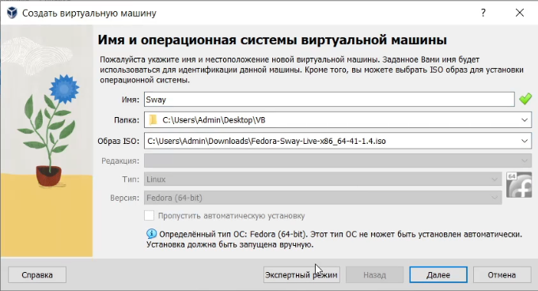  

После загрузки следуя подсказкам доустанавливаем операционную систему, устанавливаем имя пользователя и пароль.  

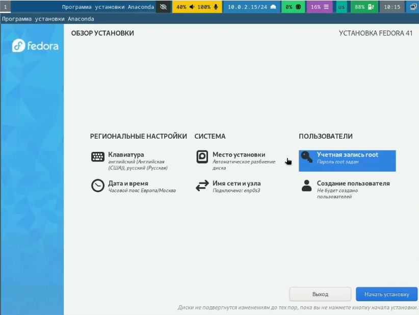  

Теперь непосредственно следуем плану, прописанному в лабораторной работе №1. Переключаемся на роль супер-пользователя и устанавливаем средства разработки.  

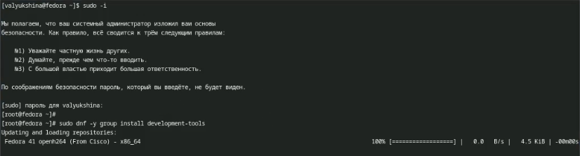  

Обновляем все пакеты и для удобства устанавливаем tmux.  

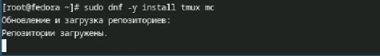  

Устанавливаем автоматическое обновление и запускаем таймер.  

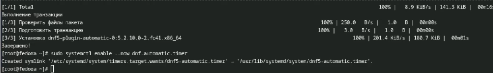  

Далее нам необходимо отключить систему безопасности SELinux. Редактируем файл и перезагружаем виртуальную машину.  

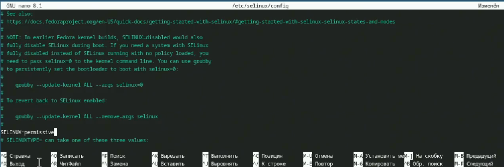  

Настраиваем раскладку клавиатуры. Создаем конфигурационный файл и редактируем его, после чего редактируем второй конфигурационный файл. Перезагружаем виртуальную машину.  

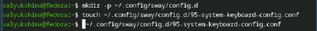  

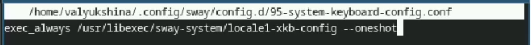  

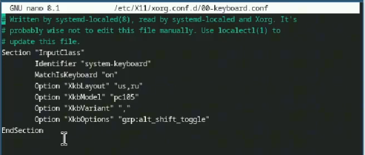  

Следующим пунктом нам нужно поменять логин и пароль, если они не удовлетворяют требованиям. Я пропускаю этот пункт, так как изначально установила верные имя и пароль. Устанавливаем имя хоста и проверяем корректность установки.  

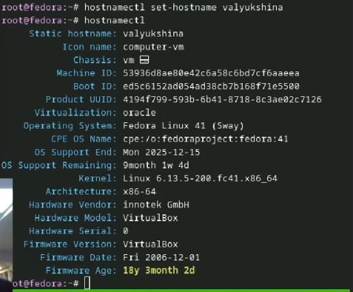  

Для работы с языком разметки Markdown будем использовать pandoc. Устанавливаем его через терминал.  

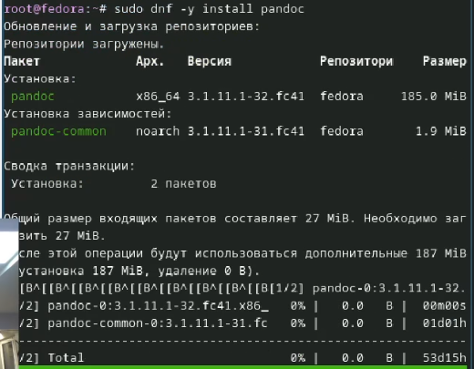  

В стандартном пакете нет доп пакета pandoc crossref, поэтому скачиваем его вручную. Смотрим версию утсановленного pandoc и скачиваем с сайта подходящий пакет. Распаковываем архив и перемещаем файлы в каталог.  

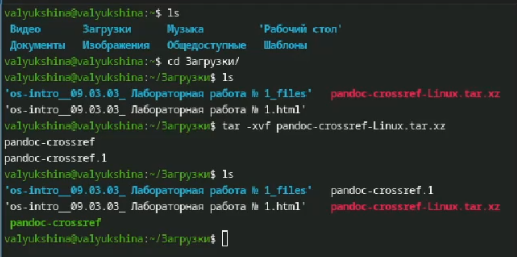  

Устанавливаем дистрибутив texlive.  

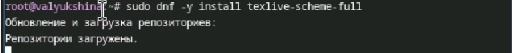  

# Домашнее задание

В домашнем задании нам нужно поработать с командой dmesg. С помощью вывода этой команды анализируем последовательность загрузки системы.  

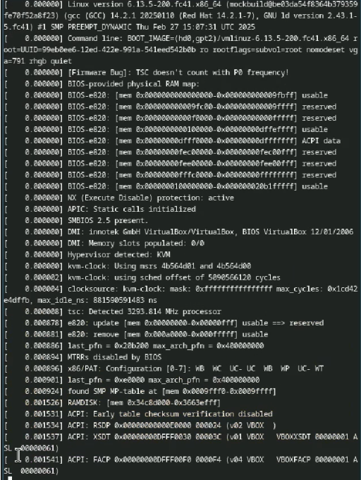  

Используя grep мы можем получить отдельную интересующую нас информацию. Используем команду и получаем требуемую информацию.  

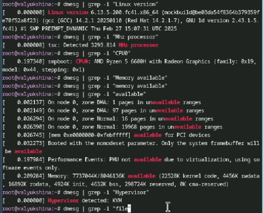  

# Контрольные вопросы

1) Какую информацию содержит учётная запись пользователя?  
Учетная запись содержит идентификатор пользователя (логин) и его пароль. Пароль хранится в зашифрованном или хэшированном виде для обеспечения его безопасности.  

2) Укажите команды терминала и приведите примеры:  
для получения справки по команде: dsmeg (dsmeg | grep -i "что ищем")  
для перемещения по файловой системе: cd (cd ~/home/work перемещение в каталог /home/work)  
для просмотра содержимого каталога: ls ( ls -l отображение подробного списка)  
для определения объёма каталога: du ( du -ah /file/path/work показать объем каждого файла и каталога)  
для создания / удаления каталогов / файлов: создание каталога (mkdir); создание пустого файла (touch); удаление каталога или файла (rm)  
для задания определённых прав на файл / каталог: chmod (изменение прав доступа)  
для просмотра истории команд: history  

3) Что такое файловая система? Приведите примеры с краткой характеристикой  
Файловая система — это способ организации, хранения и управления данными на носителях информации. Она определяет, как данные хранятся, как к ним обращаться, а также как обеспечивается их целостность и безопасность.  
Пример: NTFS (New Technology File System). Поддерживает большие файлы и разделы, журналирование, шифрование и сжатие. Совместима только с windows.  

4) Как посмотреть, какие файловые системы подмонтированы в ОС?  
Команда mount отображает список всех подмонтированных файловых систем.  

5) Как удалить зависший процесс?  
Нужно запустить диспетчер задач и снять задачу и зависшего процесса.  

# Выводы

В ходе лабораторной работы №1 мы создали новый образ виртуальной машины с новой ОС, научились настраивать через терминал и установили утилиты для удобства.
