---
## Front matter
lang: ru-RU
title: Лабораторная работа №2 
subtitle: Архитектура операционных систем
author:
  - Люкшина В. А.
institute:
  - Российский университет дружбы народов, Москва, Россия
date: 07 марта 2025

## i18n babel
babel-lang: russian
babel-otherlangs: english

## Fonts
mainfont: IBM Plex Serif
romanfont: IBM Plex Serif
sansfont: IBM Plex Sans
monofont: IBM Plex Mono
mathfont: STIX Two Math
mainfontoptions: Ligatures=Common,Ligatures=TeX,Scale=0.94
romanfontoptions: Ligatures=Common,Ligatures=TeX,Scale=0.94
sansfontoptions: Ligatures=Common,Ligatures=TeX,Scale=MatchLowercase,Scale=0.94
monofontoptions: Scale=MatchLowercase,Scale=0.94,FakeStretch=0.9
mathfontoptions:

## Formatting pdf
toc: false
toc-title: Содержание
slide_level: 2
aspectratio: 169
section-titles: true
theme: metropolis
header-includes:
 - \metroset{progressbar=frametitle,sectionpage=progressbar,numbering=fraction}
---

# Информация

## Докладчик

:::::::::::::: {.columns align=center}
::: {.column width="70%"}

  * Люкшина Влада Алексеевна
  * факультет физико-математических наук
  * студент 1 курс НПИбд-02-24
  * Российский университет дружбы народов
  * [1132243022@pfur.ru]
  * <https://github.com/valyukshina/study_2024-2025_os-intro.git>

:::
::: {.column width="30%"}

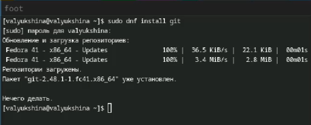

:::
::::::::::::::

# Вводная часть

## Актуальность

- Презентация является эффективным методом представления итогов и хода лабораторной работы.

## Цель

- Изучить идеологию и применение средств контроля версий. Освоить умения по работе с git.  

## Задачи
- Создать базовую конфигурацию для работы с git.
- Создать ключ SSH.
- Создать ключ PGP.
- Настроить подписи git.
- Зарегистрироваться на Github.
- Создать локальный каталог для выполнения заданий по предмету.
  

# Выполнение лабораторной работы №2
## Установка git
- Первым пунктом лабораторной работы №2 является установка git. Устанавливаем.  

  

## Установка gh
- Далее устанавливаем gh.  

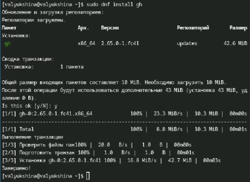  

## Настройка git
- Следующим пунктом идет базовая настройка git. Задаем свое имя и email как владельца репозитория.  

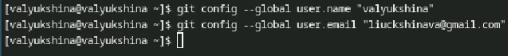  

## Начальная ветка и параметры
- Настраиваем utf-8 в выводе сообщения git. Задаем имя начальной ветки, называем ее master. Задаем два параметра: autocrlf и safecrlf.  

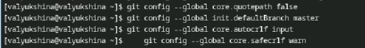  

## Создание ключей
- По алгоритму создаем ключи ssh.  

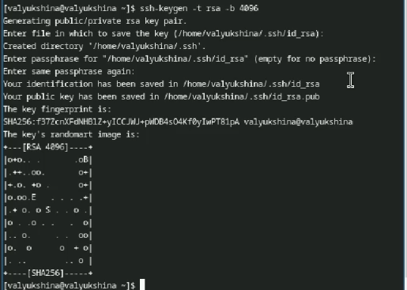  

## Создание ключей
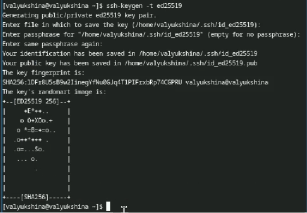  

## Генерация ключей pgp
- Генерируем ключи pgp. Выбираем предложенные опции, вводим личную информацию.  

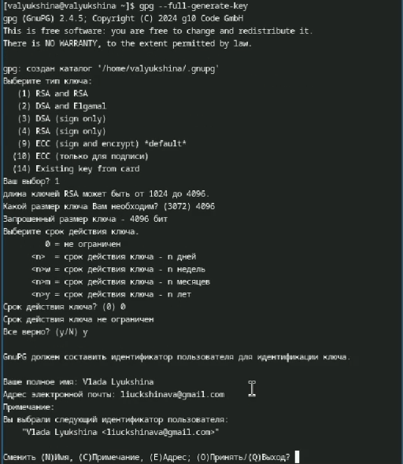  

## Приватный ключ
- Созданный ключ нам необходимо добавить в github. Выводим список ключей и копируем отпечаток приватного ключа.  

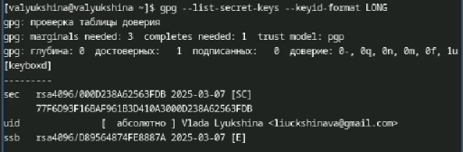  

## Добавление ключа в github
- Копируем сгенерированный PGP ключ в буфер обмена и вставляем в поле ввода в github.  

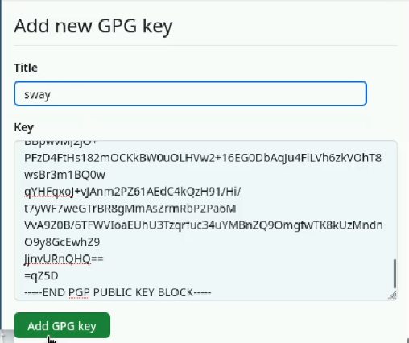  

## Настройка подписей
- Изначально коммиты неподписаны, они отмечаются как неподтвержденные. Поэтому нам необходимо настроить подписи, используя нашу почту.  

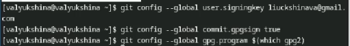  

## Авторизация в github
- Авторизируемся в gh с помощью браузера. Генерируется код для входа.  

  

## Авторизация в github
- Копируем сгенерированный код, вставляем его в открывшемся окне и авторизируемся.  

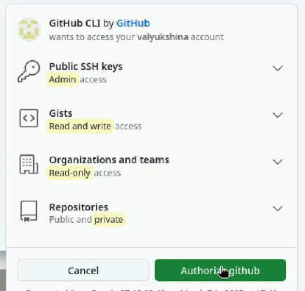  

## Создание шаблона
- После авторизации нам необходимо создать шаблон рабочего пространства. Создаем необходимые папки, переходим туда и копируем шаблон с github.  

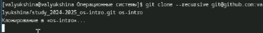  

## Настройка каталогов
- Переходим в каталог созданного курса, удаляем лишние файлы и создаем необходимые каталоги.  

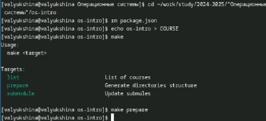  

## Отправка файлов
- Отправляем файлы на сервер.  

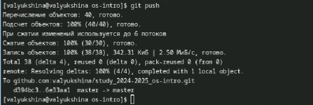  

# Выводы
## Вывод
- В ходе лабораторной работы мы научились базовым навыкам работы с github. Научились создавать репозитории, шаблоны, работать с ключами.

