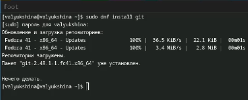

---
## Front matter
title: "Лабораторная работа №2"
subtitle: "Дисциплина: Архитектура компьютеров и операционные системы"
author: "Люкшина Влада Алексеевна"

## Generic otions
lang: ru-RU
toc-title: "Содержание"

## Bibliography
bibliography: bib/cite.bib
csl: pandoc/csl/gost-r-7-0-5-2008-numeric.csl

## Pdf output format
toc: true # Table of contents
toc-depth: 2
lof: true # List of figures
lot: true # List of tables
fontsize: 12pt
linestretch: 1.5
papersize: a4
documentclass: scrreprt
## I18n polyglossia
polyglossia-lang:
  name: russian
  options:
	- spelling=modern
	- babelshorthands=true
polyglossia-otherlangs:
  name: english
## I18n babel
babel-lang: russian
babel-otherlangs: english
## Fonts
mainfont: IBM Plex Serif
romanfont: IBM Plex Serif
sansfont: IBM Plex Sans
monofont: IBM Plex Mono
mathfont: STIX Two Math
mainfontoptions: Ligatures=Common,Ligatures=TeX,Scale=0.94
romanfontoptions: Ligatures=Common,Ligatures=TeX,Scale=0.94
sansfontoptions: Ligatures=Common,Ligatures=TeX,Scale=MatchLowercase,Scale=0.94
monofontoptions: Scale=MatchLowercase,Scale=0.94,FakeStretch=0.9
mathfontoptions:
## Biblatex
biblatex: true
biblio-style: "gost-numeric"
biblatexoptions:
  - parentracker=true
  - backend=biber
  - hyperref=auto
  - language=auto
  - autolang=other*
  - citestyle=gost-numeric
## Pandoc-crossref LaTeX customization
figureTitle: "Рис."
tableTitle: "Таблица"
listingTitle: "Листинг"
lofTitle: "Список иллюстраций"
lotTitle: "Список таблиц"
lolTitle: "Листинги"
## Misc options
indent: true
header-includes:
  - \usepackage{indentfirst}
  - \usepackage{float} # keep figures where there are in the text
  - \floatplacement{figure}{H} # keep figures where there are in the text
---

# Цель работы

Изучить идеологию и применение средств контроля версий. Освоить умения по работе с git.

# Задание

1) Создать базовую конфигурацию для работы с git.
2) Создать ключ SSH.
3) Создать ключ PGP.
4) Настроить подписи git.
5) Зарегистрироваться на Github.
6) Создать локальный каталог для выполнения заданий по предмету.

# Теоретическое введение

Система контроля версий Git представляет собой набор программ командной строки. Доступ к ним можно получить из терминала посредством ввода команды git с различными опциями.  
Благодаря тому, что Git является распределённой системой контроля версий, резервную копию локального хранилища можно сделать простым копированием или архивацией.  

# Выполнение лабораторной работы

Первым пунктом лабораторной работы №2 является установка git. Устанавливаем.  

  

Далее устанавливаем gh.  

  

Следующим пунктом идет базовая настройка git. Задаем свое имя и email как владельца репозитория.  

  

Настраиваем utf-8 в выводе сообщения git. Задаем имя начальной ветки, называем ее master. Задаем два параметра: autocrlf и safecrlf.  

  

По алгоритму создаем ключи ssh.  

  

  

Генерируем ключи pgp. Выбираем предложенные опции, вводим личную информацию.  

  

Созданный ключ нам необходимо добавить в github. Выводим список ключей и копируем отпечаток приватного ключа.  

  

Копируем сгенерированный PGP ключ в буфер обмена и вставляем в поле ввода в github.  

  

Изначально коммиты неподписаны, они отмечаются как неподтвержденные. Поэтому нам необходимо настроить подписи, используя нашу почту.  

  

Авторизируемся в gh с помощью браузера. Генерируется код для входа.  

  

Копируем сгенерированный код, вставляем его в открывшемся окне и авторизируемся.  

  

После авторизации нам необходимо создать шаблон рабочего пространства. Создаем необходимые папки, переходим туда и копируем шаблон с github.  

  

Переходим в каталог созданного курса, удаляем лишние файлы и создаем необходимые каталоги.  

  

Отправляем файлы на сервер.  

  

# Выводы

В ходе лабораторной работы мы научились базовым навыкам работы с github. Научились создавать репозитории, шаблоны, работать с ключами.

