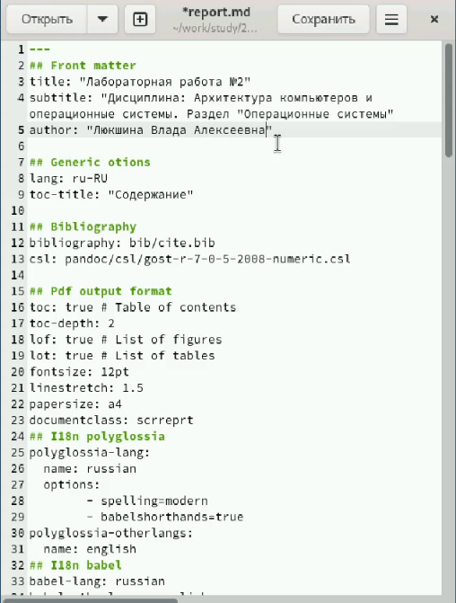
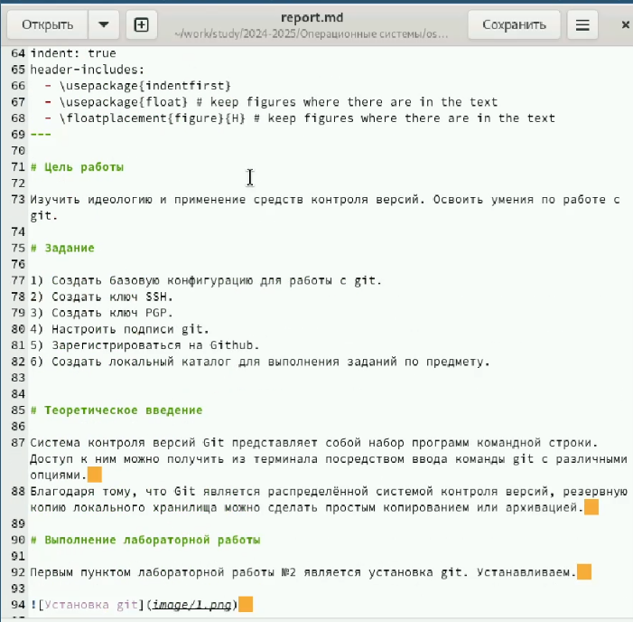
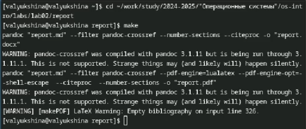
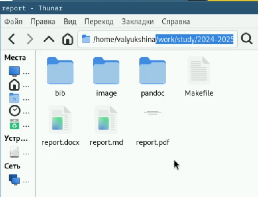

---
## Front matter
lang: ru-RU
title: Лабораторная работа №3
subtitle: Архитектура операционных систем
author:
  - Люкшина В. А.
institute:
  - Российский университет дружбы народов, Москва, Россия
date: 07 марта 2025

## i18n babel
babel-lang: russian
babel-otherlangs: english

## Fonts
mainfont: IBM Plex Serif
romanfont: IBM Plex Serif
sansfont: IBM Plex Sans
monofont: IBM Plex Mono
mathfont: STIX Two Math
mainfontoptions: Ligatures=Common,Ligatures=TeX,Scale=0.94
romanfontoptions: Ligatures=Common,Ligatures=TeX,Scale=0.94
sansfontoptions: Ligatures=Common,Ligatures=TeX,Scale=MatchLowercase,Scale=0.94
monofontoptions: Scale=MatchLowercase,Scale=0.94,FakeStretch=0.9
mathfontoptions:

## Formatting pdf
toc: false
toc-title: Содержание
slide_level: 2
aspectratio: 169
section-titles: true
theme: metropolis
header-includes:
 - \metroset{progressbar=frametitle,sectionpage=progressbar,numbering=fraction}
---

# Информация

## Докладчик

:::::::::::::: {.columns align=center}
::: {.column width="70%"}

  * Люкшина Влада Алексеевна
  * факультет физико-математических наук
  * студент 1 курс НПИбд-02-24
  * Российский университет дружбы народов
  * [1132243022@pfur.ru]
  * <https://github.com/valyukshina/study_2024-2025_os-intro.git>

:::
::: {.column width="30%"}

:::
::::::::::::::

# Вводная часть

## Актуальность

- Презентация является эффективным методом представления итогов и хода лабораторной работы.  

## Цель

- Научиться оформлять отчёты с помощью легковесного языка разметки Markdown. С помощью Markdown будут оформляться все отчеты по лабораторным работам.  

## Задачи
- Сделать отчёт по предыдущей лабораторной работе в формате Markdown, после чего преобразовать в pdf и docx.  

  
# Выполнение лабораторной работы №3
## Работа с файлом
- Открываем папку с шаблоном отчета по лабораторной работе №2 в формате md. Изменяем заголовки и ФИО.  

  

## Работа с файлом
- Прописываем цель работы и вывод, детально описываем весь ход работы, прикрепляем скриншоты.  

  

## Команда make
- Сохраняем файл и открываем терминал. Переходим в наш каталог report и используем команду make. У нас создаются файлы report.pdf и report.docx.  

  

## Проверка
- Проверяем наличие файлов и их корректность.  

  

# Выводы
## Вывод
- В ходе лабораторной работы №3 мы научились создавать отчеты в формате md, которые впоследствие можно преобразовать в файлы типов docx и pdf с помощью команды make.

