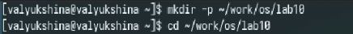
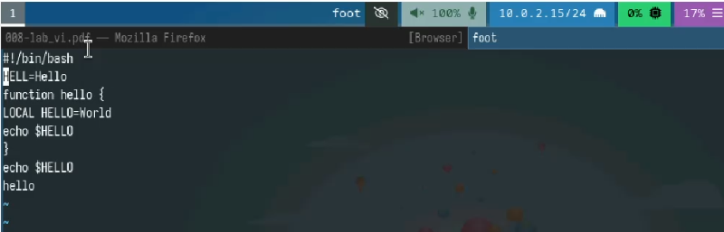
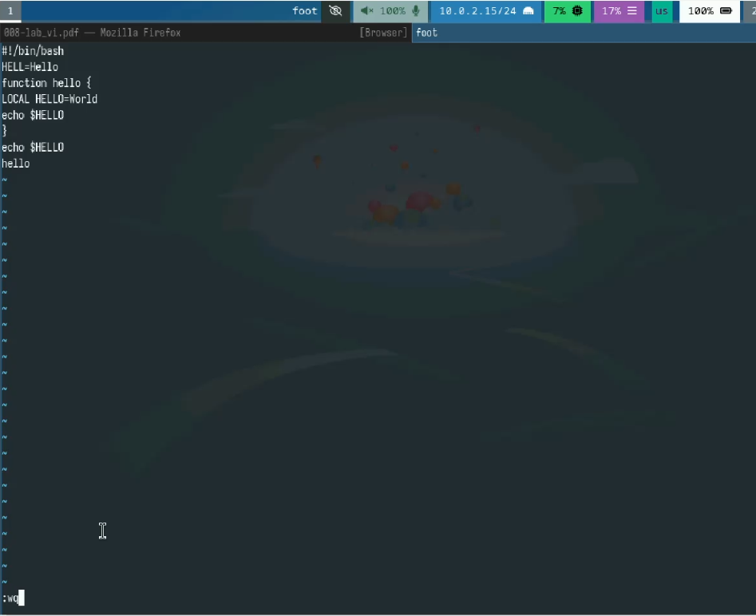
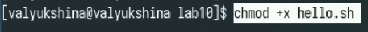
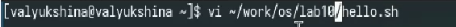
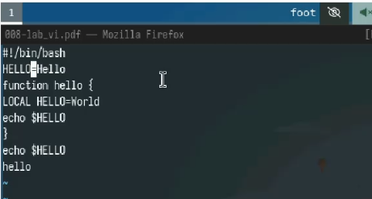
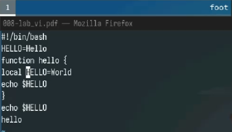
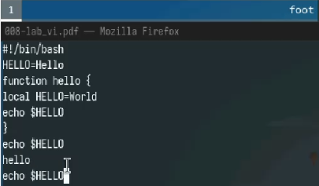
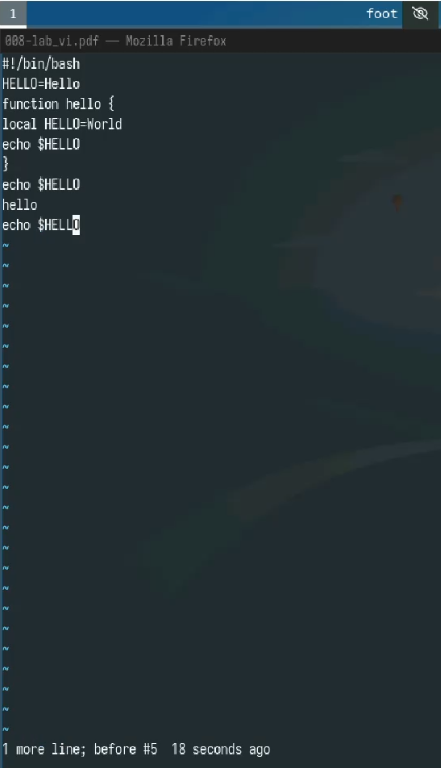
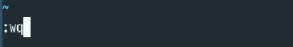

---
## Front matter
lang: ru-RU
title: Лабораторная работа №10
subtitle: Архитектура операционных систем
author:
  - Люкшина В. А.
institute:
  - Российский университет дружбы народов, Москва, Россия
date: 14 апреля 2025

## i18n babel
babel-lang: russian
babel-otherlangs: english

## Fonts
mainfont: IBM Plex Serif
romanfont: IBM Plex Serif
sansfont: IBM Plex Sans
monofont: IBM Plex Mono
mathfont: STIX Two Math
mainfontoptions: Ligatures=Common,Ligatures=TeX,Scale=0.94
romanfontoptions: Ligatures=Common,Ligatures=TeX,Scale=0.94
sansfontoptions: Ligatures=Common,Ligatures=TeX,Scale=MatchLowercase,Scale=0.94
monofontoptions: Scale=MatchLowercase,Scale=0.94,FakeStretch=0.9
mathfontoptions:

## Formatting pdf
toc: false
toc-title: Содержание
slide_level: 2
aspectratio: 169
section-titles: true
theme: metropolis
header-includes:
 - \metroset{progressbar=frametitle,sectionpage=progressbar,numbering=fraction}
---

# Информация

## Докладчик

:::::::::::::: {.columns align=center}
::: {.column width="70%"}

  * Люкшина Влада Алексеевна
  * факультет физико-математических наук
  * студент 1 курс НПИбд-02-24
  * Российский университет дружбы народов
  * [1132243022@pfur.ru]
  * <https://github.com/valyukshina/study_2024-2025_os-intro.git>

:::
::: {.column width="30%"}

:::
::::::::::::::

# Вводная часть

## Актуальность

- Презентация является эффективным методом представления итогов и хода лабораторной работы.  

## Цель

- Ознакомиться с операционной системой Linux. Получить практические навыки работы с редактором vi, установленным по умолчанию практически во всех дистрибутивах.  

## Задачи
- Создать новый файл с использованием vi и отредактировать его.  

  
# Выполнение лабораторной работы №10
## Задание 1
- Создаем каталог с именем ~/work/os/lab10 и переходим в созданный каталог.  

  

## Задание 1
- Вызываем редактор vi и создаем файл hello.sh. Переходим в режим редактирования с помощью клавиши i и вводим предложенный текст.  

  

## Задание 1
- Переходим в командный режим, после чего с помощью клавиши : переходим в режим послденей строки. Нажимаем q и w для сохранения текста и выхода из редактора, нажимаем enter и выходим из редактора.  

  

## Задание 1
- Делаем файл исполняемым.  

  

## Задание 2
- Вызываем vi на редактирование файла.  

  

## Задание 2
- Устанавливаем курсор в конец слова HELL второй строки. Переходим в режим вставки и заменяем на HELLO. Возвращаемся в командный режим.  

  

## Задание 2
- Устанавливаем курсор на четвертую строку и стираем слово LOCAL. Переходим в режим вставки и набираем следующий текст: local, возвращемся в командный режим.

  

## Задание 2
- Устанавливаем курсор на последней строке файла. Вставляем после неё строку: echo $HELLO. Переходим в командный режим.  

  

## Задание 2
- Удаляем последнюю строку. Вводим команду отмены изменений u для отмены последней команды.  

  

## Задание 2
- Переходим в режим последней строки. Записываем произведённые изменения и выходим из vi.  

  

# Выводы
## Вывод
- В ходе лабораторной работы №10 мы научились работать в редакторе vi.

